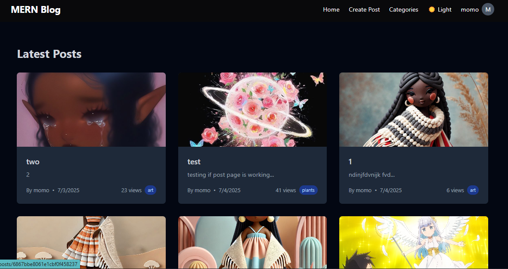
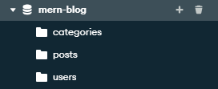
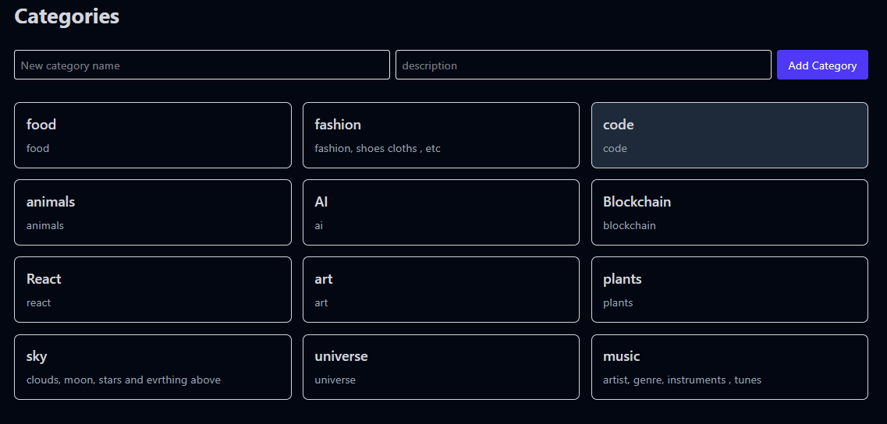
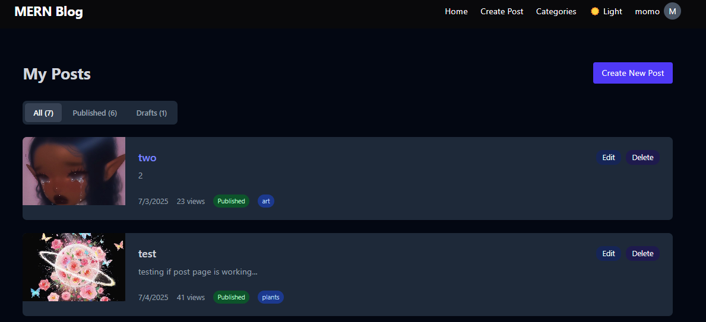

# 🔄 Week 4: Deep Dive into MERN Stack Integration

## 🚀 Objective
Build a full-stack MERN (MongoDB, Express.js, React.js, Node.js) application that demonstrates seamless integration between front-end and back-end components, including database operations, API communication, and state management.

## 📂 Tasks

### Task 1: Project Setup
- Set up a project with a clear directory structure for both client and server
- Configure MongoDB connection using Mongoose
- Set up Express.js server with necessary middleware
- Create a React front-end using Vite and configure proxy for API calls
- Implement environment variables for configuration management

### Task 2: Back-End Development
- Design and implement a RESTful API for a blog application with the following endpoints:
  - `GET /api/posts`: Get all blog posts
  - `GET /api/posts/:id`: Get a specific blog post
  - `POST /api/posts`: Create a new blog post
  - `PUT /api/posts/:id`: Update an existing blog post
  - `DELETE /api/posts/:id`: Delete a blog post
  - `GET /api/categories`: Get all categories
  - `POST /api/categories`: Create a new category
- Create Mongoose models for `Post` and `Category` with proper relationships
- Implement input validation using a library like Joi or express-validator
- Add error handling middleware for API routes

### Task 3: Front-End Development
- Create React components for:
  - Post list view
  - Single post view
  - Create/edit post form
  - Navigation and layout
- Implement React Router for navigation between different views
- Use React hooks for state management (useState, useEffect, useContext)
- Create a custom hook for API calls

### Task 4: Integration and Data Flow
- Implement API service in React to communicate with the back-end
- Set up state management for posts and categories
- Create forms with proper validation for creating and editing posts
- Implement optimistic UI updates for better user experience
- Handle loading and error states for API calls

### Task 5: Advanced Features
- Add user authentication (registration, login, protected routes)
- Implement image uploads for blog post featured images
- Add pagination for the post list
- Implement searching and filtering functionality
- Add comments feature for blog posts

## 🧪 Expected Outcome
- A fully functional MERN stack blog application
- Proper integration between MongoDB, Express.js, React.js, and Node.js
- Clean code organization with separation of concerns
- Responsive UI with good user experience
- Implementation of at least one advanced feature

## 🛠️ Setup
1. Make sure you have Node.js (v18+) and MongoDB installed
2. Clone the starter code repository
3. Install server dependencies:
   ```
   cd server
   npm install
   ```
4. Install client dependencies:
   ```
   cd client
   npm install
   ```
5. Set up environment variables as described in the `.env.example` files
6. Start the development servers:
   ```
   # In the server directory
   npm run dev
   
   # In the client directory
   npm run dev
   ```

## ✅ Submission Instructions
1. Accept the GitHub Classroom assignment invitation
2. Clone your personal repository that was created by GitHub Classroom
3. Complete all the tasks in the assignment
4. Commit and push your code regularly to show progress
5. Include in your repository:
   - Complete client and server code
   - `.env.example` files for both client and server
   - A comprehensive README.md with:
     - Project overview
     - Setup instructions
     - API documentation
     - Features implemented
     - Screenshots of the application
6. Your submission will be automatically graded based on the criteria in the autograding configuration
7. The instructor will review your submission after the autograding is complete 

### screenshot of working application

 

